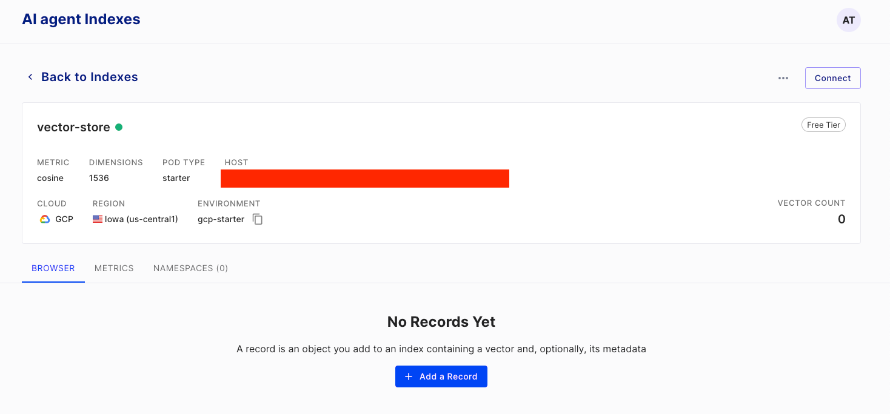

# Vector database store for Laravel

This package provides an implementation of multiple vector databases (e.g. [Pinecone.io](https://www.pinecone.io/)).

### Installation
`Requires PHP ^8.2`
```bash
composer require adrianmtanase/laravel-vector-store
```

### Currently supports
* [Pinecone.io](https://www.pinecone.io/)
* [Weaviate](https://github.com/timkley/weaviate-php)

### Plans to implement
* [MySql](https://planetscale.com/blog/planetscale-is-bringing-vector-search-and-storage-to-mysql) - once it's ready

### Usage
Using the `VectorStore` facade, you can easily access any provider and execute operations.



```php
VectorStore::dataset('vector-store')
           ->namespace('general')
           ->upsert(
               PineconeUpsertRequest::build()
                   ->id('1')
                   ->values([
                       -0.002739503,
                       -0.01970483,
                       -0.011307885,
                       -0.011125952,
                       -0.023119587,
                       0.0016207852,
                       -0.003981551,
                       -0.029249357,
                       0.00983842,
                       -0.023721369
                   ])
                   ->metadata([
                       'text' => 'Vector store is lit!'
                   ])
           );
```

The default provider is `Pinecone.io`, this can be easily switched using the facade `VectorStore::provider(VectorStoreProviderType::PINECONE)`, or directly in the `vector-store` [config](https://github.com/adrianmtanase/laravel-vector-store/blob/main/config/vector-store.php).